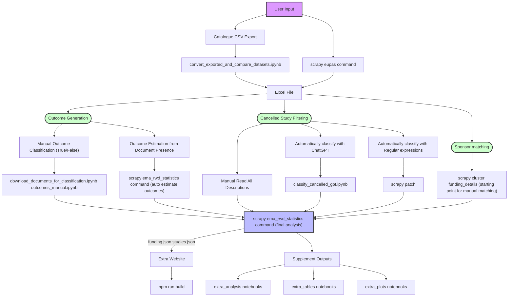

# EU PAS Register Data Matching
This repository contains raw data, notebooks, and script outputs.

## Legend
This is a legend for all the files in this repository:
+ `./data`
    + This folder contains raw and processed data. See `README.md` inside these folders for further help.
+ `./notebook`
    + This folder contains Jupyter notebooks for some important tasks. Read the explanations inside the notebooks for further help.
+ `./output`
    + This folder contains output data created by the custom `statistic` commands and scrapy spiders

## Data flowchart
The following flowchart illustrates the data flow for analysis. We used scraped and exported datasets, classifying the outcomes and cancelled studies manually. See [here](eupas_commands.md) for additional explanations.

