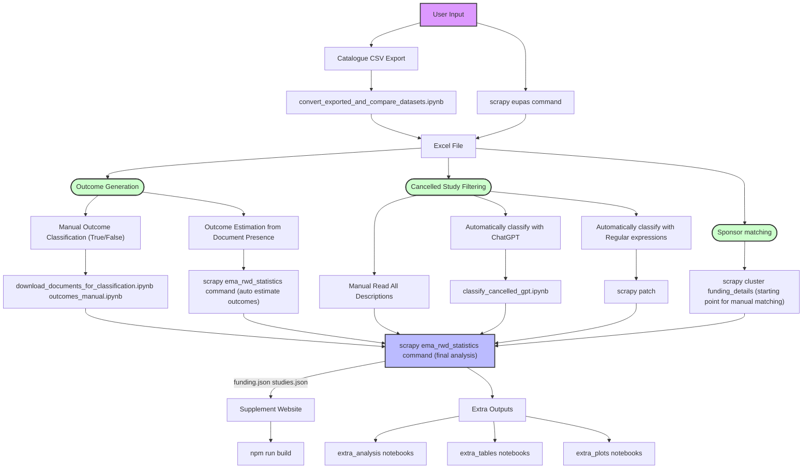

# EU PAS Data and Notebooks
 

This repository contains the data and notebooks used to analyse the metadata of the [HMA-EMA RWD Studies Catalogue](https://catalogues.ema.europa.eu/) (short: Catalogue) on **21 February 2024**, with the aim to evaluate the adherence of post-authorisation studies (PAS) with legislation and recommendations to make public protocols and results. This repository also hosts all statistical outputs.

The Catalogue is a registry for non-interventional PAS managed by the European Medicines Agency (EMA). Non-interventional PAS included in a risk management plan (RMP) category 1 or 2 are **required** by law to register the protocol and results in this registry. Other non-interventional PAS are only **recommended** to register their protocol and results in this registry.

## Legend
This is a legend for all the files in this repository:
+ `./data`
    + This folder contains raw and processed data. See `README.md` inside these folders for further help.
+ `./notebook`
    + This folder contains Jupyter notebooks for some important tasks. Read the explanations inside the notebooks for further help.
+ `./output`
    + This folder contains output data created by the custom `statistic` commands and Scrapy spiders in this [repository](https://github.com/EU-PAS-Adherence/EU-PAS-Scraper).

## Data flowchart
The following flowchart illustrates the data flow for analysis. We used scraped and exported datasets, classifying the outcomes and cancelled studies manually. Regular expressions and ChatGPT were **not** used to detect cancelled studies in the final analysis. See [here](ema_rwd_commands.md) for additional explanations.

```mermaid
flowchart TD
    %% Main outcome generation block
    J(["Outcome Generation"])
    J --> G["Manual Outcome Classification (True/False)"]
    J --> I["Outcome Estimation from Document Presence"]

    G --> F["download_documents_for_classification.ipynb outcomes_manual.ipynb"]
    I --> H["scrapy ema_rwd_statistics command (auto estimate outcomes)"]

    F --> K["scrapy ema_rwd_statistics command (final analysis)"]
    H --> K

    %% User input and data flow
    A[User Input] --> B[Catalogue CSV Export]
    A --> C[scrapy eupas command]

    B --> D[convert_exported_and_compare_datasets.ipynb]
    D --> E[Excel File]
    C --> E
    E --> J

    %% Cancelled study filtering
    E --> L(["Cancelled Study Filtering"])
    L --> M[Manual Read All Descriptions]

    L --> X1["Automatically classify with ChatGPT"]
    X1 --> N[classify_cancelled_gpt.ipynb]

    L --> X2["Automatically classify with Regular expressions"]
    X2 --> O[scrapy patch]

    M --> K
    N --> K
    O --> K

    %% Sponsor matching branch
    E --> S(["Sponsor matching"])
    S --> T["scrapy cluster funding_details (starting point for manual matching)"]
    T --> K

    %% Final outputs
    K -- "`funding.json studies.json`" --> V["Supplement Website"]
    V --> U["npm run build"]

    K --> W["Extra Outputs"]
    W --> P[extra_analysis notebooks]
    W --> Q[extra_tables notebooks]
    W --> R[extra_plots notebooks]

    %% Styling
    style A fill:#d9f,stroke:#333,stroke-width:2px,color:#333
    style J fill:#cfc,stroke:#333,stroke-width:2px,color:#333
    style L fill:#cfc,stroke:#333,stroke-width:2px,color:#333
    style S fill:#cfc,stroke:#333,stroke-width:2px,color:#333
    style K fill:#bbf,stroke:#333,stroke-width:2px,color:#333
```
